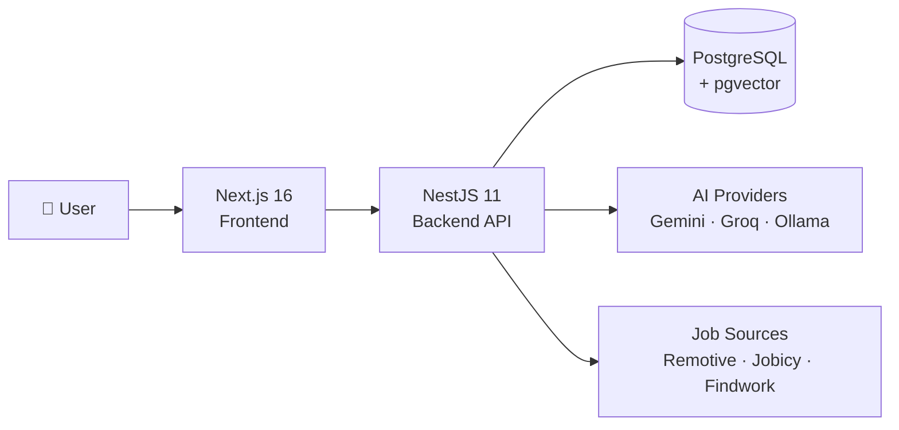
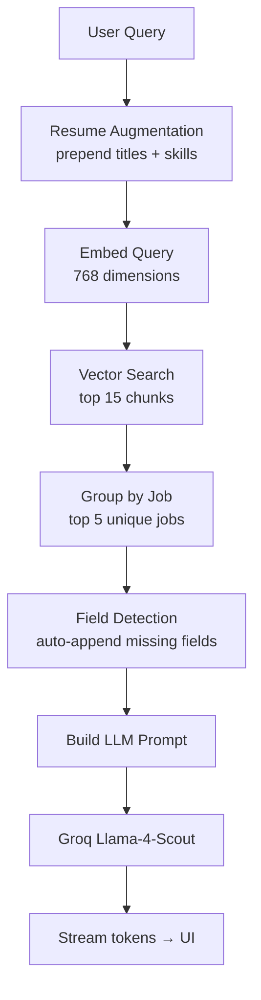

# JobAI — AI-Powered Job Search Platform

> A full-stack remote job aggregation platform with an AI copilot powered by Retrieval-Augmented Generation (RAG).


---

## What It Does

Job searching is fragmented. Filters are limited. Most "AI" features on job boards are decoration.

JobAI aggregates remote listings from three public APIs, processes them through a full RAG pipeline, and exposes them through a streaming AI assistant that can answer questions no keyword filter can: *"Which roles match my Python and AWS background?"*, *"What are the most common requirements in senior backend listings?"*, *"Find full-stack jobs paying above $120k."*

Upload your resume and the AI becomes aware of your skills — every query is silently augmented with your background before hitting the vector search.

---

## Key Features

- **AI Copilot** — streaming answers grounded in real job data, with source attribution and similarity scores
- **Resume Intelligence** — upload a PDF, the backend parses it with an LLM and augments every search with your skills and titles
- **Smart Query Routing** — regex-first classifier routes to Retrieval (RAG), Aggregation (SQL), or Hybrid paths
- **Job Aggregation** — pulls from Remotive, Jobicy, and Findwork every 6 hours via cron
- **Semantic Search** — 768-dim cosine similarity search via pgvector, no separate vector DB needed
- **Browse & Filter** — keyword, location, job type, remote toggle, salary range — URL-synced with debounce
- **Saved Jobs** — bookmark listings, use them as context for AI queries

---

## Architecture



### RAG Pipeline



---

## Tech Stack

| Layer | Technologies |
|---|---|
| **Frontend** | Next.js 16.2 · React 19 · TypeScript · Tailwind CSS v4 |
| **UI** | Radix UI · shadcn/ui · Lucide React · React Markdown · Sonner |
| **State & Forms** | Zustand · React Hook Form · Zod |
| **Backend** | NestJS 11 · TypeScript · Prisma 7 |
| **Database** | PostgreSQL · pgvector (768-dim cosine similarity) |
| **Embeddings** | Google Gemini `gemini-embedding-001` (prod) · Ollama `e5-base-v2` (dev) |
| **LLM** | Groq `llama-4-scout` (prod) · Ollama `llama3.1` (dev) |
| **Job Sources** | Remotive · Jobicy · Findwork |
| **Auth** | JWT · bcrypt · httpOnly cookies |

---

## Project Structure

```
RAG-JobPosting/
├── frontend/          # Next.js 16 App Router
│   └── src/app/
│       ├── (public)/  # Landing, Login, Register
│       └── (app)/     # Jobs, Saved Jobs, Profile
└── backend/           # NestJS 11
    └── src/
        ├── auth/      # JWT auth
        ├── rag/       # RAG pipeline
        ├── embedding/ # Gemini / Ollama
        ├── llm/       # Groq / Ollama
        ├── ingestion/ # Cron + job pipeline
        ├── resume/    # PDF parsing
        ├── jobs/      # Browse & filter
        └── user/      # Profile & favorites
```

---

## Getting Started

### Prerequisites

- Node.js 20+
- PostgreSQL with pgvector extension
- pnpm (`npm install -g pnpm`)
- Either a Groq + Gemini API key (production) or Ollama running locally (development)

### Backend

```bash
cd backend
cp .env.example .env   # fill in DATABASE_URL, GROQ_API_KEY, GEMINI_API_KEY, JWT_SECRET
pnpm install
pnpm prisma migrate deploy
pnpm start:dev
```

### Frontend

```bash
cd frontend
cp .env.example .env.local   # set NEXT_PUBLIC_API_URL=http://localhost:3000/api/v1
pnpm install
pnpm dev --port 3001
```

### Seed the database

Once the backend is running, trigger the first ingestion cycle from the admin endpoint:

```bash
curl -X POST http://localhost:3000/api/v1/ingestion/run \
  -H "x-api-key: YOUR_ADMIN_API_KEY"
```

Jobs will be fetched, parsed, chunked, and embedded. This takes a few minutes on first run.

---

## Engineering Highlights

**pgvector over a dedicated vector DB** — The entire stack runs on a single PostgreSQL instance. No Pinecone, no Qdrant, no synchronization logic. pgvector handles cosine similarity search on 768-dim embeddings with full ACID guarantees.

**Dual embedding provider** — Gemini in production, Ollama locally. Zero cost in development, no API keys needed. The application tracks which model produced each embedding to keep indexes consistent.

**Structured chunking** — Each job is parsed by an LLM into typed fields (requirements, responsibilities, benefits, identity). Each field becomes its own chunk. Retrieval precision improves significantly over generic sliding-window chunking.

**Regex-first query classification** — Common aggregation queries ("how many…", "most common…") are routed without touching an LLM. Only genuinely ambiguous queries fall through to the LLM classifier. Retrieval queries go directly to the RAG pipeline.

---

## Case Study

A full technical case study covering the problem, architecture, RAG pipeline design, key engineering decisions, and learnings is available in [`caseStudy.md`](./caseStudy.md).

---

## License

MIT
