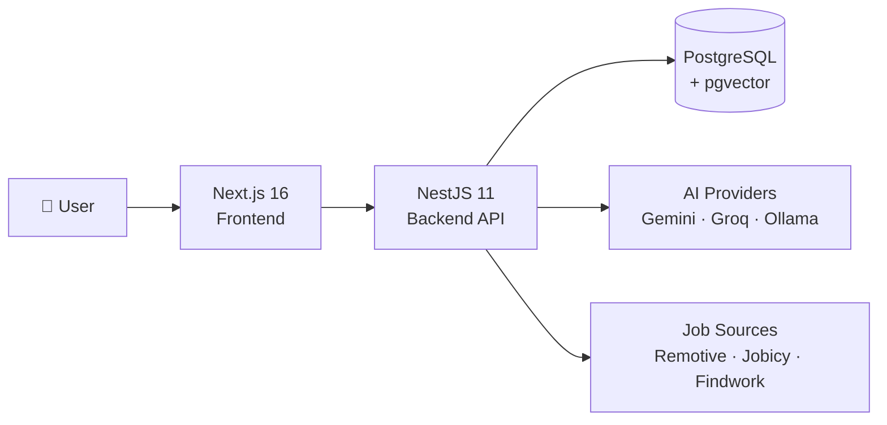
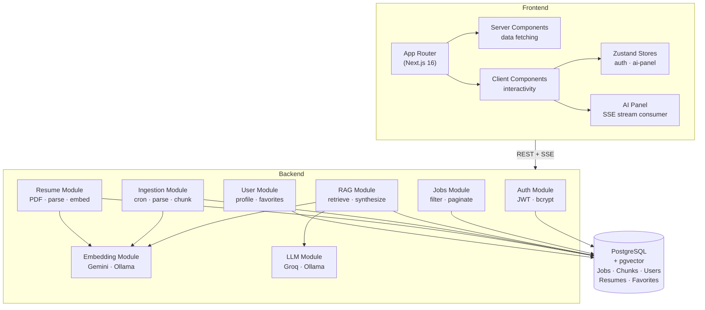
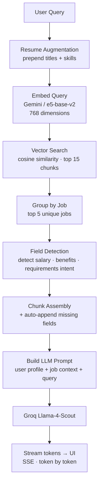
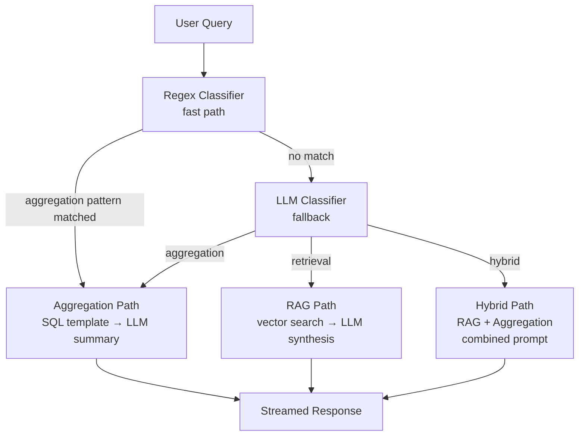
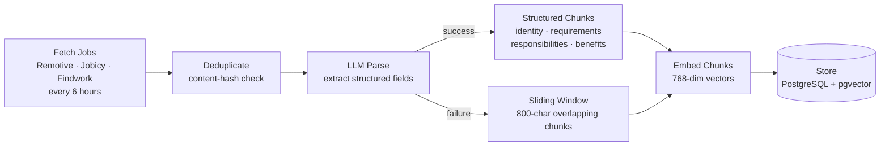

# JobAI — AI-Powered Job Search Platform

## Quick Facts

| | |
|---|---|
| **Type** | Full-stack solo project |
| **Role** | Full-stack developer (solo) |
| **Stack** | Next.js 16 · NestJS 11 · PostgreSQL · pgvector · Groq · Google Gemini |
| **Core Feature** | RAG-powered AI copilot for job search |

---

## Problem & Goals

Remote job searching is a fragmented experience. Listings are scattered across dozens of platforms, search filters rely on exact keyword matching, and the tools available to candidates haven't meaningfully changed in years. A developer looking for roles that align with their specific skill set—TypeScript, cloud infrastructure, distributed systems—has to open multiple tabs, scan through irrelevant results, and manually evaluate dozens of postings to find a handful of genuine matches.

Most projects that add "AI" to a job board treat it as decoration: a chatbot over static data, or a similarity score bolted onto a keyword filter. The challenge here was different—to build a platform where the AI copilot *is* the search engine, grounded in real job data, aware of the user's resume, and capable of reasoning across an aggregated dataset of remote listings in ways that a filter panel simply cannot.

The goal was to ship a complete, production-minded platform: one that aggregates real job data from multiple sources, stores it in a way that enables semantic search, and exposes it through a streaming AI interface built on top of a proper Retrieval-Augmented Generation pipeline.

---

## Solution Overview

JobAI is a remote job aggregation platform with an AI copilot at its core. A user can browse and filter a real-time dataset of remote jobs, upload their resume to personalize the experience, save jobs for later, and—most importantly—ask the AI assistant questions that keyword search cannot answer: *"What full-stack roles in my stack are paying above $120k?"*, *"Which of the jobs I saved match my Python experience?"*, or *"What are the most common requirements across these senior backend listings?"*

The system is organized around three layers: a Next.js frontend that handles authentication, browsing, and the streaming AI panel; a NestJS backend that orchestrates the RAG pipeline, ingestion scheduler, and all API logic; and a PostgreSQL database extended with pgvector that serves as both the relational store and the vector search engine.

---

## Architecture

The frontend and backend communicate over a standard REST API, with one exception: the AI query endpoint uses server-sent events to stream tokens to the client in real time. Authentication runs through httpOnly cookies set by Next.js Route Handlers—the access token never touches client-side JavaScript.

The backend is organized as a collection of NestJS modules with well-defined responsibilities: Auth handles JWT issuance and validation, Jobs exposes the browsing and filtering API, RAG owns the retrieval and synthesis logic, Embedding wraps the vector model providers, LLM wraps the completion providers, Ingestion manages the data pipeline, Resume handles PDF upload and parsing, and User manages profiles and saved jobs.

Everything lands in a single PostgreSQL database. The relational schema handles users, jobs, favorites, and resumes. The same database—extended with the pgvector extension—stores 768-dimensional embedding vectors for each job chunk and each user resume, enabling cosine similarity search without a separate vector store.

---

## AI Core: The RAG Pipeline

### How It Works

At the heart of JobAI is a Retrieval-Augmented Generation pipeline—a pattern where a language model answers questions using retrieved context rather than its training data alone. This is what separates the AI copilot from a generic chatbot: every answer is grounded in the actual job listings stored in the database.

When a user submits a query, the pipeline begins with augmentation. If the user has uploaded a resume, their top job titles and skills are prepended to the raw query before anything else happens. A search for "backend roles in fintech" becomes "Python AWS distributed-systems backend roles in fintech"—the resume makes the search implicitly aware of what the user brings to the table.

The augmented query is then embedded into a 768-dimensional vector using Google Gemini's embedding model in production, or a local e5-base-v2 model via Ollama in development. That vector is compared against all stored job chunk embeddings using cosine similarity—the 15 most semantically relevant chunks are retrieved from the database, grouped by job, and the top 5 unique jobs are assembled into a prompt context.

Before the prompt is finalized, a field detection pass checks what the user is asking about. If the query mentions salary and the retrieved chunks don't include compensation data, the system automatically appends the structured salary field from the job record. The same logic applies to requirements, benefits, and responsibilities—ensuring the LLM only synthesizes from data that is actually present, rather than filling gaps with plausible-sounding fabrications.

The completed prompt—user profile, job context, and query—is sent to Groq's Llama-4-Scout model, which streams the response token by token back through the API and into the UI.

### Query Classification

Not every question is a retrieval question. "How many remote Python jobs are in the dataset?" is better answered with a SQL count than a RAG pipeline. To handle this, the system classifies each incoming query before routing it.

Classification runs in two stages. First, a set of regex patterns checks the query for aggregation signals—words like "how many", "count", "average", "most common". If a pattern matches, the query is routed directly to the aggregation path, which executes a SQL template and summarizes the result. If no pattern matches, an LLM classifier makes the decision, choosing between retrieval, aggregation, or hybrid—where both paths run in parallel and their outputs are combined into a single prompt.

---

## Data Ingestion Pipeline

The platform aggregates job listings from three public APIs—Remotive, Jobicy, and Findwork—on a six-hour cron schedule. Each ingestion cycle fetches listings across multiple job categories, deduplicates against the existing dataset using a SHA-256 content hash, and processes only new or changed records.

Each new job goes through an LLM-based parsing step. A structured extraction prompt—around 125 lines of carefully tuned instructions—asks the model to pull out title, company, location, job type, skills, responsibilities, requirements, benefits, and salary from the raw listing text. The model is explicitly instructed not to infer or hallucinate: if a field is not present, it returns null. The output is validated against a schema before anything is written to the database.

Jobs that parse successfully are chunked into typed segments: an identity chunk (title, company, location, summary), a requirements chunk, a responsibilities chunk, and a benefits chunk. Each chunk is embedded independently and stored alongside its vector. Jobs that fail parsing fall back to a sliding-window chunker that splits the raw text into overlapping 800-character windows, preserving semantic boundaries where possible. No listing goes un-indexed regardless of whether structured parsing succeeds.

---

## Frontend

### Architecture

The frontend is built on Next.js 16's App Router, with a deliberate split between Server and Client Components. Pages that primarily display data—the jobs list, the profile page—are Server Components that fetch from the backend on the server, keeping tokens out of the browser entirely. Interactive elements—filters, the AI panel, save toggles—are Client Components mounted on top of that server-rendered foundation.

Authentication follows the Next.js 16 convention: login and registration flow through Route Handlers that proxy credentials to the backend, receive a JWT, and set it as an httpOnly cookie. A `proxy.ts` file guards protected routes and redirects to login if no cookie is present. On the client, a Zustand store hydrates the user profile from a server-side fetch on initial load, keeping auth state consistent across the app without ever exposing the token.

### Key Features

The AI panel is a right-side drawer that opens alongside the job grid. When a user submits a query, the frontend calls the streaming endpoint and consumes the response through an `AsyncGenerator` backed by a `ReadableStream` and `TextDecoder`. Events arrive as newline-delimited JSON with distinct types for stream initialization, token delivery, source attribution, and errors. The UI renders each token incrementally using React Markdown, and displays the source jobs—with their similarity scores—once the stream completes.

Resume upload uses a drag-and-drop interface backed by a `multipart/form-data` POST. The backend extracts text from the PDF, parses it with an LLM, and returns structured data—name, location, skills, work history—that auto-fills the profile form. Job filters are URL-synced with a 300-millisecond debounce, so every filter state is shareable and browser-navigable. Save and unsave actions use optimistic updates: the UI toggles immediately and reverts only on error.

---

## Key Engineering Decisions

**Keeping vectors in PostgreSQL.** The most common approach to building a RAG system adds a dedicated vector database—Pinecone, Weaviate, Qdrant—alongside the relational store. JobAI keeps everything in PostgreSQL using the pgvector extension, storing and querying 768-dimensional embeddings alongside relational data. The benefit is significant: no second service to run, no synchronization logic, and full ACID guarantees on chunk upserts. The trade-off is that PostgreSQL's vector search performs a sequential scan without explicitly configured IVFFlat or HNSW indexes—fast enough at tens of thousands of chunks, but a genuine consideration at millions of records.

**Running two embedding providers.** Production uses Google Gemini's `gemini-embedding-001` model, which produces high-quality 768-dimensional vectors against API quota. Development uses `e5-base-v2` running locally via Ollama—same dimensional space, zero cost, no internet required. The queue managing Gemini requests enforces one concurrent request with a two-second delay between calls to stay within per-minute limits, with a secondary API key that rotates in automatically on daily quota exhaustion. The key constraint of this setup is consistency: because the two models don't produce identical embeddings, the application tracks which model produced each vector and keeps production and development indexes separate.

**Classifying queries with regex before reaching for an LLM.** Routing every query through an LLM classifier would add latency and consume tokens for patterns that are entirely unambiguous. The system checks each query against regex patterns for aggregation intent first. Only when no pattern matches does the LLM classifier run. This makes the common case—straightforward retrieval queries—fast and cheap, while preserving the LLM's flexibility for genuinely ambiguous requests. The trade-off is that the regex ruleset requires maintenance as new query patterns emerge.

**Structured chunking as the default, sliding window as the fallback.** A generic sliding-window chunker splits text at fixed intervals regardless of content, which often produces chunks that blend requirements, benefits, and description into a single undifferentiated block. When the LLM parser successfully extracts structured fields, those fields become typed chunks—a requirements chunk contains only requirements, a benefits chunk contains only benefits. A query about benefits then retrieves benefits chunks with higher precision than it would retrieve a mixed chunk that happens to mention benefits in passing. The sliding window remains as a fallback for listings the parser cannot reliably extract.

---

## What I Learned

Building a RAG system from scratch clarifies something that documentation rarely makes explicit: retrieval quality matters more than model quality. Sending a capable language model a poorly constructed context—chunks that mix irrelevant content, miss the fields the user is asking about, or repeat the same job from multiple angles—produces worse answers than sending a simpler model a tightly assembled, precisely relevant prompt. The chunking strategy, the field detection logic, and the similarity threshold have more impact on output quality than swapping between models. That realization shifted where the engineering effort was concentrated.

Operating across two LLM providers in parallel—Gemini for embeddings, Groq for completions, both with per-minute and per-day quota limits—forced a level of attention to failure handling that most tutorials skip entirely. Exponential backoff, per-key quota tracking, automatic fallback to a secondary key, queue-based concurrency control to prevent burst exhaustion: none of these are interesting to build, but all of them are necessary for a system that runs a six-hour cron job against external APIs without human supervision. Building them solo also meant developing a habit of writing down trade-offs before committing to an approach—a practice that turned out to be as valuable as any specific technical decision made along the way.

---

## Tech Stack

| Layer | Technologies |
|---|---|
| **Frontend** | Next.js 16.2 · React 19 · TypeScript · Tailwind CSS v4 |
| **UI Components** | Radix UI · shadcn/ui · Lucide React · React Markdown |
| **State & Forms** | Zustand · React Hook Form · Zod |
| **Backend** | NestJS 11 · TypeScript · Prisma 7 |
| **Database** | PostgreSQL · pgvector (768-dim cosine similarity) |
| **Embeddings** | Google Gemini `gemini-embedding-001` (prod) · Ollama `e5-base-v2` (dev) |
| **LLM** | Groq `llama-4-scout` (prod) · Ollama `llama3.1` (dev) |
| **Job Sources** | Remotive · Jobicy · Findwork (public APIs, cron every 6h) |
| **Auth** | JWT · bcrypt · httpOnly cookies |
| **Infra** | NestJS Schedule · NestJS Throttler · Terminus health checks · pino logging |
